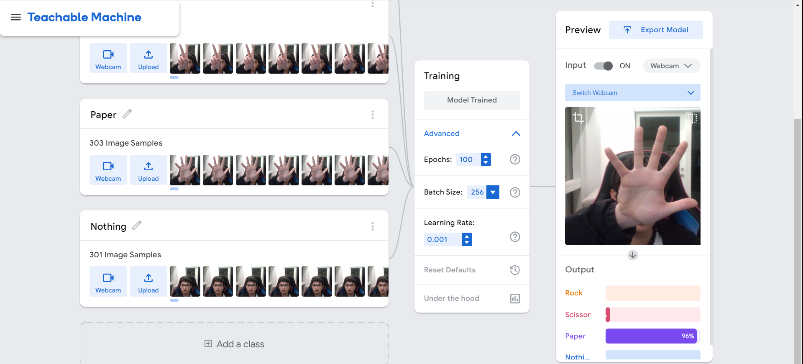

# RockScissorPaperProject

## MileStone 1
- I have created a simple model that could do image classification tasks and download them with labels.
- This model could have 4 different outcomes: Rock, Scissor, Paper and Nothing. The model could capture significant features within the input image and use that to determine the corresponding categoriy of the image. Finally, the class with the highest probability is the output.
- To maximize the model accuracy, I used a very big "feature" which could entirely block my face when Scissor, Rock, Paper options were chosen. In this way, the model could easily distinguish between different classes by checking the presence of my face as well as the shape of my hand. The drawback of this method is that the model couldn't generalize well and will fail to accurately predict under other situations.
- The hyperparameters were set by experience where generally a 100 epoch would work for such a easy task. The batch size was chosen to be 256 and the learning rate was chosen to be 0.001. Hopefully it was trained by Adam.
- Before downloading the model, several simple tests were done, which showed that the model was not that accurate as it couldn't output one high probability while the other 3 probabilities stay low, indicating that the model is unsure.
- The model was downloaded and could be further used easily. 

